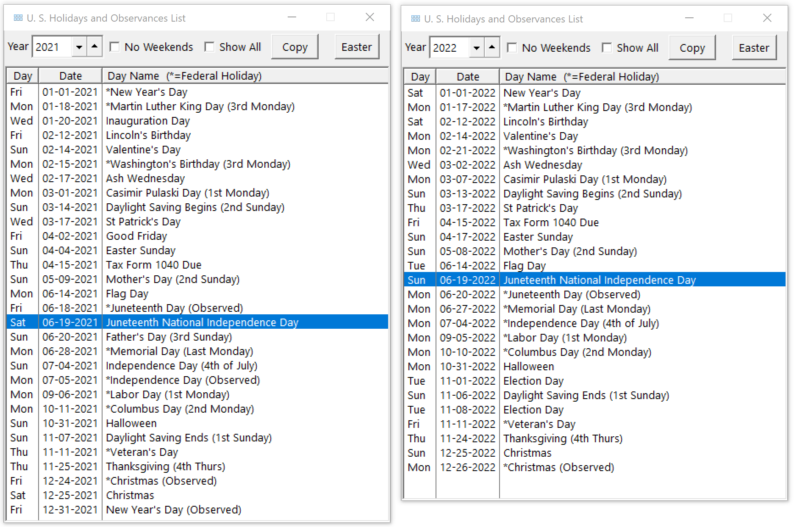

# Holiday-Calculator

 Holiday Calculations in Clarion code from New Year's day to Thanksgiving and Christmas. Has two different Easter Calculations. Actual and Observed (i.e. Monday or Friday).

 
